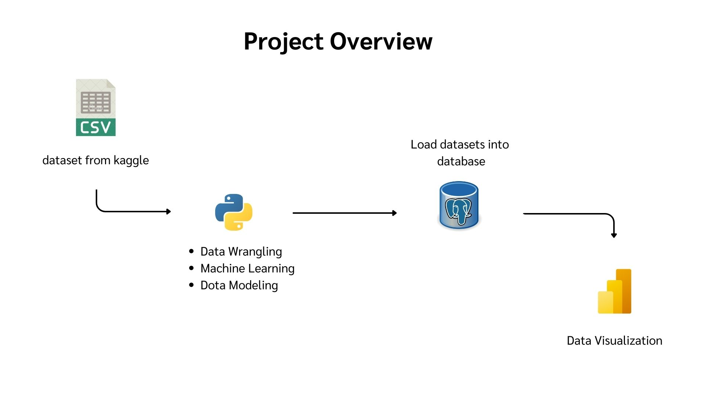
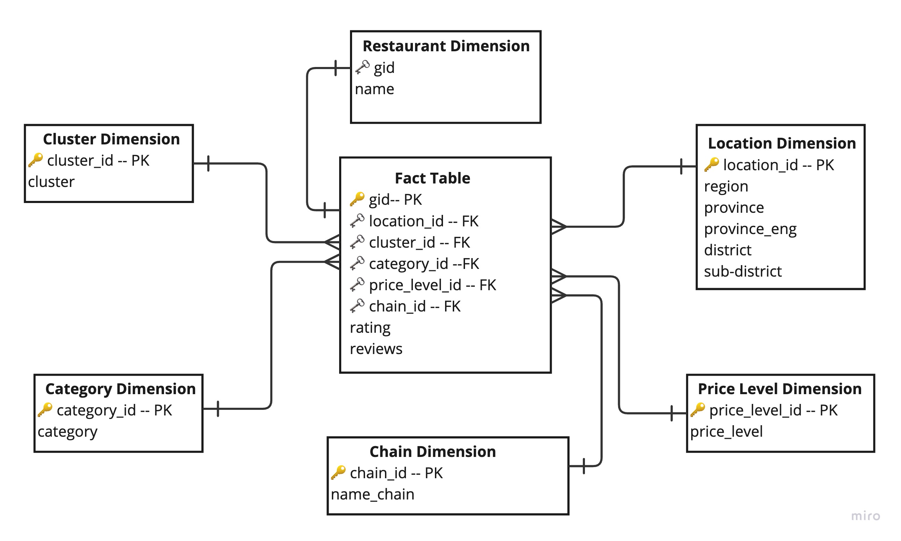

# LINEMAN DATA ANALYTIC
## Introduction
The goal of this project is to perform data analytic on dataset using various tools, Python, SQL cloud database, Power BI.

## Data Used
Thailand restaurant dataset from Lineman application, food delivery application in Thailand.

Features include, "merchant_id","gid","id_source","name","distance","cuisine","price_level","lat","lon","image_url","category","category_international","opening_hours","id_chain","name_chain","reviews_nr","rating","address","facebook","phone","email","url".

more info about this dataset: [https://www.kaggle.com/datasets/polartech/300000-restaurants-in-southeast-asia-thailand](https://www.kaggle.com/datasets/polartech/300000-restaurants-in-southeast-asia-thailand)

## Contents
- Project Overview
- Data Wrangling
- Machine Learnign
- Data Modeling
- Results

## Project Overview

## Data Wrangling
Methods
- Data cleaning: removing missing values
- Text data extraction: parsing Information from text columns.
- Data labeling: creating new categorical columns.
- Data deduplication: removing duplicate Records.
- Data reduction: eliminating irrelevant data.

## Machine Learning
Utilize K-means model to segment data into meaningful groups.

Methods
1. Data Standardize 
2. Elbow Method: identify a range of K
3. Train Model
5. Silhouette score: to select optimal K

## Data Modeling

The datasets are structured into dimensional model (Star Schema design), for later analytical purposes.

## Results
BI Dashboard - [click here!!](https://app.powerbi.com/view?r=eyJrIjoiMTFjMDJjYTUtMTk3Mi00MDMzLTg3ZjktNjI5ZjYzMjA2ZjI0IiwidCI6IjhlYzc0YTM5LWRkZjYtNDFlMS1iMGEyLWZmMDQ1OWVhOGViOCIsImMiOjEwfQ%3D%3D)